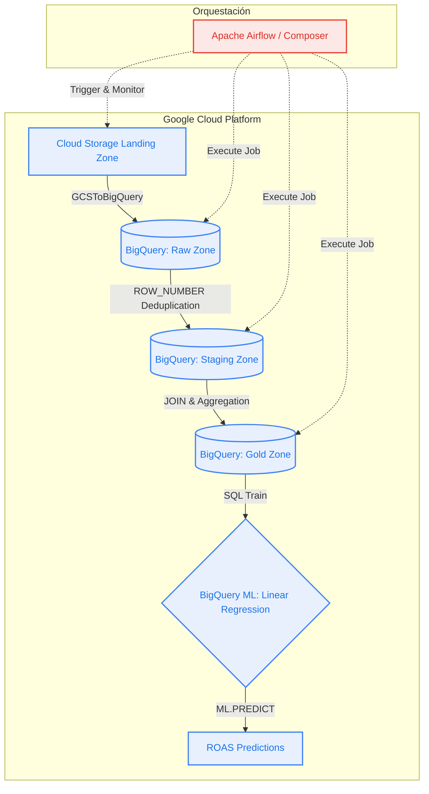

# E-Commerce Analytics & ML Pipeline on GCP


## Descripción del Proyecto
Este proyecto implementa un pipeline de datos empresarial (End-to-End) para un escenario de comercio electrónico. Extrae datos transaccionales y de campañas de marketing, orquesta las transformaciones necesarias para garantizar la calidad de los datos, y culmina en el entrenamiento de un modelo de Machine Learning predictivo para calcular el Retorno de Inversión Publicitaria (ROAS).

El pipeline está construido con una arquitectura Medallón (Raw, Staging, Gold) totalmente nativa en la nube, optimizada para analítica de negocios y escalabilidad.

## Arquitectura del Sistema

El siguiente diagrama ilustra el flujo de datos y la orquestación gestionada por **Cloud Composer (Airflow)**:


## Características Principales

1. **Ingesta Automatizada:** Lectura de archivos CSV (Transacciones y Desempeño de Marketing) desde Google Cloud Storage hacia la zona Raw de BigQuery.
2. **Limpieza y Transformación (ETL):** Deduplicación robusta utilizando `ROW_NUMBER() OVER()` (Window Functions) y estandarización de tipos de datos en la zona Staging.
3. **Capa Semántica de Negocio:** Construcción de un Dashboard en la zona Gold uniendo esfuerzos de marketing con conversiones de ventas mediante `SAFE_DIVIDE` para el cálculo del ROAS.
4. **Machine Learning Integrado (BigQuery ML):** Entrenamiento de un modelo de Regresión Lineal directamente en el Data Warehouse mediante SQL.
* **Métricas del Modelo Base:** $R^2 = 0.56$ (Capaz de explicar el 56% de la varianza del ROAS utilizando únicamente gasto, clics y conversiones).


## Tecnologías Utilizadas

* **Infraestructura:** Google Kubernetes Engine (GKE) subyacente.
* **Orquestación:** Google Cloud Composer 2 (Apache Airflow).
* **Almacenamiento y DWH:** Google Cloud Storage, Google BigQuery.
* **Machine Learning:** BigQuery ML.
* **Lenguajes:** Python (DAGs), Standard SQL (Transformaciones y ML).

## Estructura del Repositorio

```text
├── dags/
│   └── ecommerce_enterprise_analytics.py   # DAG principal de Airflow
├── sql/
│   └── bq_ml_roas_prediction.sql           # Query de entrenamiento y evaluación del modelo ML
├── data/
│   ├── landing_transactions.csv            # Datos simulados de ventas
│   └── campaign_performance.csv            # Datos simulados de marketing
└── README.md

```

## Próximos Pasos (Roadmap)

* Integrar un backend en Java o Python para exponer un endpoint REST que consuma las predicciones de BigQuery ML en tiempo real.
* Añadir dimensionalidad al modelo predictivo (estacionalidad, categorías de productos) para incrementar la precisión del R2.
* Conectar la tabla Gold a Looker Studio para visualización de métricas en vivo.

## Imagenes


\


\


\


\


\


----

**Desarrollado por:** Rodrigo García Olvera
